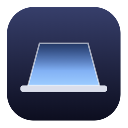
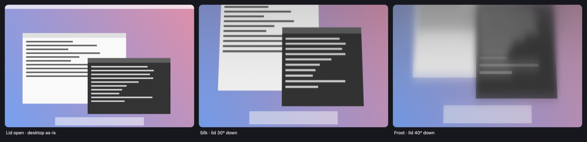
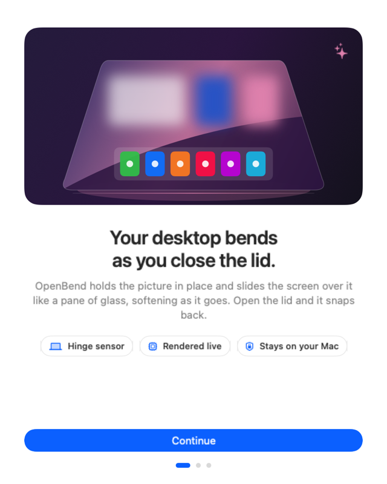
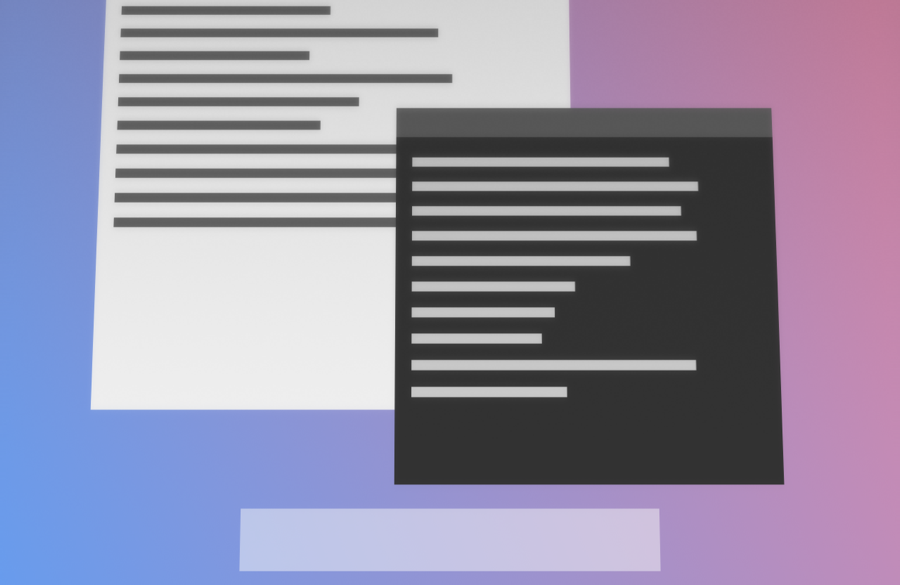
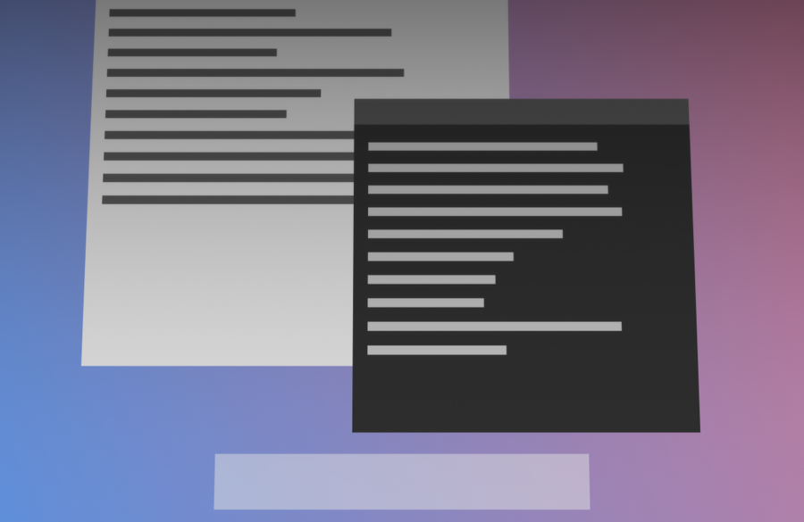
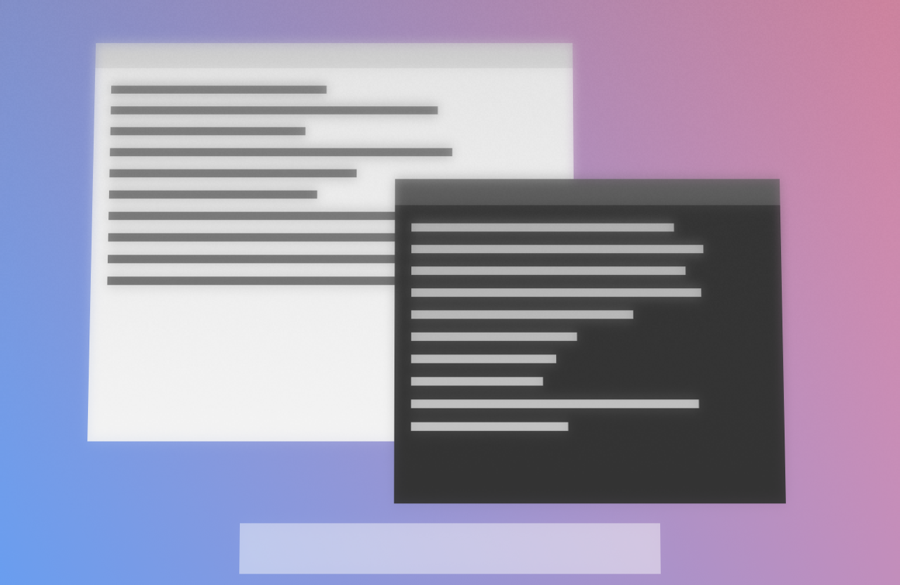

<p align="center">
  
</p>

<h1 align="center">OpenBend</h1>

<p align="center">
  <b>Your desktop bends as you close the lid.</b><br>
  The iPhone Duo fold, for the MacBook you already own. Free and open source.
</p>

<p align="center">
  <a href="https://github.com/BrodySalvucci/OpenBend/actions/workflows/build.yml"></a>
  
  
  
  
  
</p>

<p align="center">
  
</p>

<p align="center">
  
</p>

Close the lid and the desktop doesn't just switch off. The picture stays standing where it was,
the panel slides down over it like a pane of glass, and the further the glass pulls away from the
content the more it softens. Open the lid and it snaps back with a soft click.

Everything is rendered live on the GPU from a capture of your own screen. Nothing is recorded,
saved or uploaded.

## Install

**Download**: grab `OpenBend.zip` from the [latest release](https://github.com/BrodySalvucci/OpenBend/releases/latest),
unzip, and drag OpenBend to Applications. The build isn't notarized, so macOS blocks the first
open. Go to System Settings → Privacy & Security and click **Open Anyway**, or clear the
quarantine flag yourself:

```bash
xattr -dr com.apple.quarantine /Applications/OpenBend.app
```

**Or build it yourself** (only the Xcode Command Line Tools are needed):

```bash
git clone https://github.com/BrodySalvucci/OpenBend.git
cd OpenBend
make install     # builds build/OpenBend.app and copies it to /Applications
```

### First launch

1. Open OpenBend. It lives in the menu bar and asks for Screen Recording.
2. System Settings → Privacy & Security → Screen Recording → turn on **OpenBend**.
3. Choose **Quit & Reopen** when macOS asks.

Use **Preview Bend** in the menu bar to see the effect without touching the lid.

### Requirements

- macOS 14 Sonoma or later.
- An Apple silicon MacBook with a lid angle sensor. Macs without the sensor can still drive the
  effect by hand with the Angle slider.
- Screen Recording permission, so the desktop can be captured.

## Styles

**Duo** is the default: clear at the hinge, progressively softer toward the top edge, like the
fold on a folding phone.

**True Duo** makes the screen itself the foldable. It is creased across the middle: the lower half
stays exactly as it is, and the upper half folds down toward you as the lid closes, frosting over
with a hard edge at the crease and shrinking toward it, the way the folding half of the phone does.
Past its far edge the panel goes dark. Perspective sets how quickly it foreshortens, Blur how heavy
the frost is, and Shadow how much its far edge darkens.

Three more if you want a different feel:

| Silk | Shade | Frost |
| --- | --- | --- |
|  |  |  |
| A clean tilt with a whisper of blur. | The lid casts a shadow as it comes down. | Frosted glass. The desktop softens into haze. |

Perspective, Blur and Shadow are on sliders. Move one and the style becomes **Custom**.

## Settings

- **Start after closing**: downward travel from your current open position before bending begins (default 3°, range 1–15°). Open back near that starting point to clear it. The old fixed `clearAngle` preference is no longer used.
- **Stays on below** and **Clears after resting**: stop lowering the lid above the stay-on angle (default 70°) and the effect relaxes away after the rest time (default 1.5 s), so you can lower the screen a little and keep working. Below that angle the effect holds however long the lid rests.
- **Follow the lid**: turn off to drive the angle yourself with the Angle slider.
- **Click when the desktop clears**, **Launch at login**, **Paused**.
- **Esc** while the desktop is bending pauses OpenBend.

The closing trigger learns your open posture. With the default 3° setting, starting at 100°
triggers at 97°; starting at 125° triggers at 122°. The fold's reference stays fixed while active.
Reopening 1° past that reference clears it and learns a fresh starting position. Resting above the stay-on angle also clears it and learns the resting position, so closing further needs the full travel again. A one-degree flicker at rest doesn't count as movement, and a slow close keeps producing new lows, so it never times out mid-motion. OpenBend only takes keyboard focus (for Esc) once the lid is below the stay-on angle, so adjusting the lid never swallows your typing. Pause/resume,
wake, and switching input modes also relearn the current posture. Capture warms up on the first
movement before activation and cools down after a quiet second.

## How it works

| Part | What it does |
| --- | --- |
| **Lid sensor** | Reads the hinge angle straight from the Mac's own lid angle sensor, an Apple HID device on the Sensor usage page. No accessibility hacks, no guessing from the light sensor. |
| **Live desktop** | ScreenCaptureKit streams the built-in display at up to 60 fps while the lid is moving and trickles at 10 fps otherwise. |
| **Projection** | The desktop is frozen on the plane where the lid was when the bend began. Every panel pixel is cast from a fixed eye position onto that plane, so the bottom stays anchored at the hinge, the menu bar slips out of view first, and the picture stays standing while the panel moves over it. |
| **Diffusion** | Blur grows with the gap between glass and content: clear at the hinge, soft at the top. A two-pass Gaussian in Metal, working at whatever resolution keeps it band-free, plus a frosted-glass treatment. |
| **Tracker** | Original sensor timestamps reconstruct motion between whole-degree readings, including slow movement and reversals. Prediction is bounded to 0.75° of the sensor reading, and the filter keeps settling after motion stops. |
| **Sound** | A short synthesized click, generated in memory. No audio files. |

### Tuning knobs

These have no UI and take effect live:

```bash
defaults write com.openbend.OpenBend eyeHeightRatio -float 0.5   # look-down angle (eye height ÷ distance)
defaults write com.openbend.OpenBend keystone -float 0.4         # horizontal narrowing, 1 = exact, 0 = none
defaults write com.openbend.OpenBend smoothing -float 0.03       # display low-pass, seconds
defaults write com.openbend.OpenBend leadTime -float 0.03        # motion lead to cancel latency, seconds
```

## Building

```bash
make               # release build → build/OpenBend.app
make run           # build and launch
make install       # copy to /Applications
make trigger-test  # relative closing gesture and rearming checks
make motion-test   # quantized sensor replay at 60/120 Hz
make render-test   # render the shader offline to build/render-test-out/*.png
make clean
```

Prefer Xcode? `xcodegen generate` uses the included `project.yml`.

### Signing and the Screen Recording grant

macOS ties the Screen Recording grant to the app's code signature. Ad-hoc signatures (the
default) change on every rebuild, so after a rebuild the toggle in System Settings can show
**on** while the app is still denied. Two ways out:

- **One-off**: clear the stale entry and grant again.
  ```bash
  tccutil reset ScreenCapture com.openbend.OpenBend && open /Applications/OpenBend.app
  ```
- **Permanent**: create a self-signed certificate once with `scripts/make-signing-cert.sh`.
  The build script picks it up automatically. Or pass your own
  `CODESIGN_IDENTITY="Developer ID Application: …"` to `scripts/build.sh`.

## Layout

```
Sources/OpenBend/
  App.swift                   entry point
  AppDelegate.swift           windows and wiring
  BendController.swift        lid tracker, show/hide, capture lifecycle, preview
  BendMath.swift              viewing model shared by the app and the offline test
  BendRenderer.swift          Metal pipeline: mips, separable blur, final pass
  Shaders.swift               MSL source, compiled at launch
  LidAngleSensor.swift        IOKit HID polling of the hinge angle
  ScreenCapturer.swift        ScreenCaptureKit stream
  OverlayWindow.swift         full-screen borderless window above everything
  Settings.swift              persisted user settings
  SettingsView.swift          SwiftUI settings and permission onboarding
  StatusItemController.swift  menu bar
  ClickSound.swift            synthesized click
  SystemHelpers.swift         launch at login, permission, screen helpers
scripts/build.sh              SwiftPM build + .app assembly + codesign
scripts/make-icon.swift       renders the app icon
scripts/render-test.swift     offline shader check
scripts/make-signing-cert.sh  self-signed cert for a stable signature
```

Debug switches: `OPENBEND_CAPTURABLE=1` lets `screencapture` see the overlay (it is normally
hidden from capture so it can't feed back into itself); `OPENBEND_SHOW_SETTINGS=1` opens
Settings at launch.

## Credits

Inspired by [Bendy](https://trybendy.app). Lid sensor access follows the approach documented in
[samhenrigold/LidAngleSensor](https://github.com/samhenrigold/LidAngleSensor).

MIT licensed.
